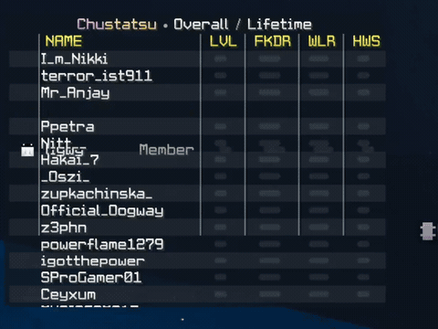
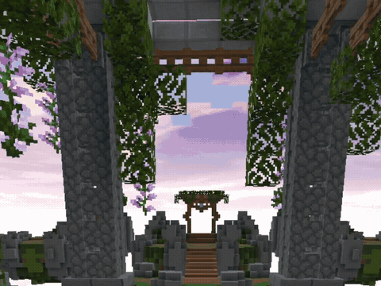

<p align="center">
  
</p>
<h1 align="center">ChuStatsu</h1>

<p align="center">A client-side 1.8.9 Ornithe/Legacy Fabric Gen2 minecraft mod that displays PikaNetwork BedWars statistics in TAB list, a HUD, and nametags. Aimed for oneclient 1.8.9</p>

<p align="center">
  <a href="https://github.com/liwwyy/ChuStatsu/releases/"></a>
  <a href="https://github.com/liwwyy/Chustatsu/releases/latest"></a>
  <a href="https://discord.com/users/1476376719668674620"></a>
</p>


> [!WARNING]
> This is a passion project built and maintained with **AI**.

# Gallery




# Features

<details>
<summary><strong>BedWars statistics in TAB</strong></summary>

- Replaces the player list with a statistics table for PikaNetwork BedWars. The TAB panel has its own movable OneConfig HUD handle and starts centered on a fresh configuration.
- Shows up to 40 players, with separate controls for waiting rooms, active games, and other situations. Set the player limit, show or hide the header, and optionally include a match overview and installed client badges.
- Sorts waiting room players by a chosen statistic. During matches, it can group teams in Red, Blue, Green, Yellow, Aqua, White, Pink, Gray order. Team colors can remain visible on spectating players, whose names appear italicized.
- Optionally combines ranks with names, shows loading placeholders, alternates row backgrounds, and draws column dividers.

</details>

<details>
<summary><strong>Compact, movable HUD</strong></summary>

- Displays a separate BedWars statistics table on screen, with its own position, columns, appearance, sorting, and player limit (1–40).
- Shows in the waiting room by default. Choose whether it also appears in games or stays visible elsewhere, and whether holding TAB hides it.
- Configure its header, rank placement, loading placeholders, alternating rows, and column dividers independently from TAB.

</details>

<details>
<summary><strong>Stats, modes, and columns</strong></summary>

- Choose **Overall**, **Solo**, **Doubles**, or **Quads** statistics, and a **Lifetime**, **Weekly**, **Monthly**, or **Yearly** period.
- Reorder and hide columns separately in TAB and the HUD using OneConfig's draggable lists. Available columns are **player head**, **dynamic or fixed-width name**, **level**, **FKDR**, **WLR**, **winstreak**, **final kills**, **wins**, **beds**, **guild**, **rank**, and **ping**. TAB also offers an **HP** column.
- Adjust column spacing and choose whether ping includes the `ms` suffix. HP can be restricted to active games.

</details>

<details>
<summary><strong>Player context and nametags</strong></summary>

- Highlights party members and friends in TAB and the HUD. Party members can be placed first, followed by friends found in cached PikaNetwork profiles.
- An optional experimental setting groups players who arrive in a waiting room at about the same time; its arrival window is adjustable.
- Adds one selected statistic to player nametags: **FKDR**, **level**, **WLR**, **winstreak**, **final kills**, **wins**, or **beds**. Place it above or alongside the username and choose where nametag stats appear.
- Includes optional, experimental denick tracking based on unambiguous scoreboard team name replacements. It can be limited to waiting rooms and can show a resolved real name when one is found; detection is not guaranteed.

</details>

<details>
<summary><strong>Appearance and animation</strong></summary>

- Customize TAB and HUD backgrounds independently, including opacity, rounded glass styling, alternating rows, and dividers. Choose Minecraft, Poppins, or a custom TTF font, with separate text and divider shadow settings.
- Set show and hide effects to **None**, **Slide**, **Zoom**, **Bounce**, or **Pop**. Player arrivals, departures, and table resizing have their own animation options and durations.
- Enable low performance mode to turn off animations and glass backgrounds.

</details>

<details>
<summary><strong>Local and Catbox background images</strong></summary>

- Give TAB and the HUD separate background images. Select a PNG by filename from `config/chustatsu/backgrounds/`, or choose a random image from that folder.
- Optionally fetch a random image from Catbox for either table. Each has a **Fetch** button to request another image; downloaded images are cached locally so an earlier image remains available if Catbox is unreachable.
- Set image opacity, size, and left/center/right placement for each table. An additional setting keeps image size steady as the table changes. Reload images and fonts from OneConfig after changing local assets.

</details>

<details>
<summary><strong>Requests, caching, and commands</strong></summary>

- Fetches PikaNetwork data asynchronously through a paced request service. Profile data is cached separately and supplies friend names; successful statistics remain visible during transient API failures.
- Honors API `Retry-After` responses with a shared cooldown, then retries rate-limited players. Nicked, no-stats, rate-limited, and other API errors use a single status field instead of repeating a message across every column.
- By default, runs only on PikaNetwork BedWars and limits statistics requests to games and waiting rooms. These restrictions and the maximum number of players requested from the API are configurable.
- Use `/chustatsu` (or `/chuoverlay`) to open settings and `/stats <player>` to look up a player. A keybind can toggle the mod.

</details>

# Setup

1. Get the latest chustatsu-x.x+mc1.8.9.jar from [releases](https://github.com/liwwyy/ChuStatsu/releases/latest). Alternatively you can build the project yourself, see [build](#build)
2. Place the mod in your oneclient instances mods folder. OneConfig v1 required

## Build

Use Java 25 and the project-local Gradle cache:

```sh
GRADLE_USER_HOME="$PWD/.gradle" ./gradlew build
```

The remapped mod jar is `build/libs/chustatsu-1.1+mc1.8.9.jar`. The build runs the JUnit and local HTTP tests.
